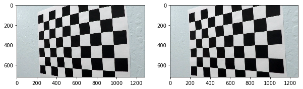
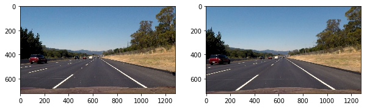
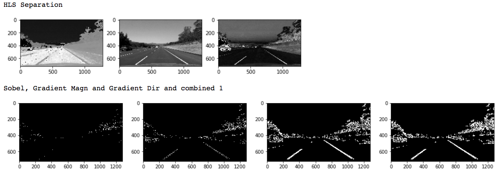
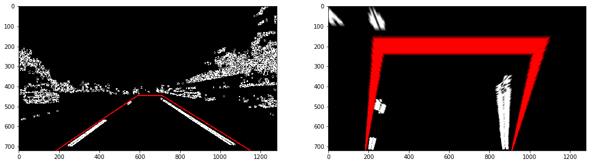
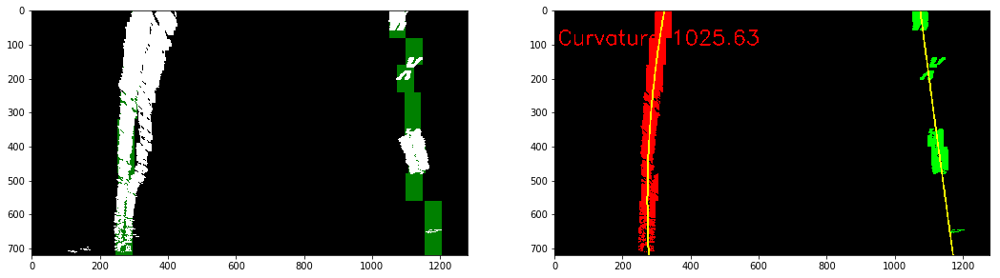
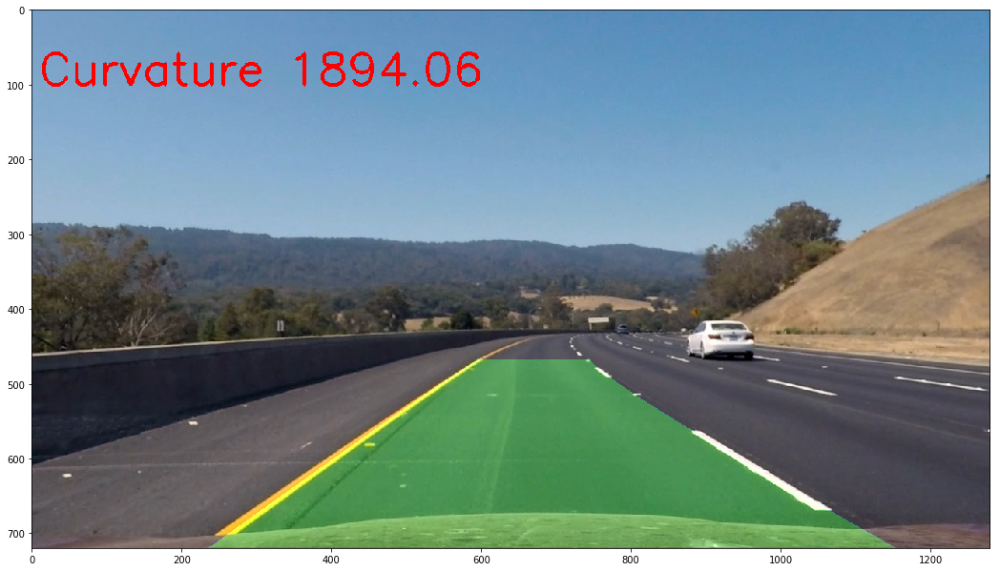

# Advanced Lane Finding Project

The goals / steps of this project are the following:

* Compute the camera calibration matrix and distortion coefficients given a set of chessboard images.
* Apply a distortion correction to raw images.
* Use color transforms, gradients, etc., to create a thresholded binary image.
* Apply a perspective transform to rectify binary image ("birds-eye view").
* Detect lane pixels and fit to find the lane boundary.
* Determine the curvature of the lane and vehicle position with respect to center.
* Warp the detected lane boundaries back onto the original image.
* Output visual display of the lane boundaries and numerical estimation of lane curvature and vehicle position.

[//]: # (Image References)

[image1]: ./examples/undistort_output.png "Undistorted"
[image2]: ./test_images/test1.jpg "Road Transformed"
[image3]: ./examples/binary_combo_example.jpg "Binary Example"
[image4]: ./examples/warped_straight_lines.jpg "Warp Example"
[image5]: ./examples/color_fit_lines.jpg "Fit Visual"
[image6]: ./examples/example_output.jpg "Output"
[video1]: ./project_video.mp4 "Video"

## [Rubric](https://review.udacity.com/#!/rubrics/571/view) Points

### Here I will consider the rubric points individually and describe how I addressed each point in my implementation.  

---

### Writeup / README

#### 1. Provide a Writeup / README that includes all the rubric points and how you addressed each one.  You can submit your writeup as markdown or pdf.   

You're reading it!

### Camera Calibration

#### 1. Briefly state how you computed the camera matrix and distortion coefficients. Provide an example of a distortion corrected calibration image.

The code for this step is contained in the first code cell of the IPython notebook located in [Advanced Lane Finding.ipynb](https://github.com/SvenKratz/CarND-Advanced-Lane-Lines-P4/blob/master/Advanced%20Lane%20Finding%20Project.ipynb).  

I start by preparing "object points", which will be the (x, y, z) coordinates of the chessboard corners in the world. Here I am assuming the chessboard is fixed on the (x, y) plane at z=0, such that the object points are the same for each calibration image.  Thus, `objp` is just a replicated array of coordinates, and `objpoints` will be appended with a copy of it every time I successfully detect all chessboard corners in a test image.  `imgpoints` will be appended with the (x, y) pixel position of each of the corners in the image plane with each successful chessboard detection.  

I then used the output `objpoints` and `imgpoints` to compute the camera calibration and distortion coefficients using the `cv2.calibrateCamera()` function.  I applied this distortion correction to the test image using the `cv2.undistort()` function and obtained this result:



(Left: original, Right: calibrated image)

### Pipeline (single images)

The section "Static/Development Processing Pipeline Script" in the iPython notebook contains the single image processing pipeline that I used to develop the video processing pipeline.  

#### 1. Provide an example of a distortion-corrected image.

To demonstrate this step, I will describe how I apply the distortion correction to one of the test images like this one:


(Left: original, Right: corrected image)

#### 2. Describe how (and identify where in your code) you used color transforms, gradients or other methods to create a thresholded binary image.  Provide an example of a binary image result.

I used a combination of color and gradient thresholds to generate a binary image.

##### Color Thresholding using HLS

First, I convert the input image into HLS color space. I use the S channel as main source for lane lines, as they seem to be more prominent in this channel. However, I noticed that shadowy areas on the road can cause unwanted artifacts. I noticed that these shadows do show up prominently on in the H channel. Therefor I use the H channel to mask the shadows from the thresholded S channel using simple algebra as follows (lines 60--66 in the previously mentioned notebook cell):

```Python
# S seems like a good choice, so select this image for further processing
St = color_threshold(S, (120, 255))

# H seems good to detect shadowy areas, which mess up lane finding
# idea: use thresholded H to mask shadowy areas from S
Ht = color_threshold(H, (0, 30))
St = St * (1 - Ht)
```

##### Application of Gradients to Highlight Lane Lines

After the thresholding step I use a binary or combination of gradient magnitude and gradient direction to filter out most of the image parts that are not the lane lines. The binary or function is implemented as follows:

```Python
def combine_binary_or(img_a, img_b):
    # combine (OR) two binary images and output results
    binary_output_combined = np.zeros_like(img_a)
    binary_output_combined[(img_a == 1) | (img_b == 1)] = 1
    return binary_output_combined
```

The final thresholded and combined binary image  is generated as follows (lines 80--82 ):

```Python
gradient_magn = mag_threshold(St, sobel_kernel= 7, thresh=(180, 255))
gradient_dir = dir_threshold(St, sobel_kernel = 7, thresh=(0.6, 1.4))
combined = combine_binary_or(gradient_magn, gradient_dir)
```

The furthest image to the right example of the resultant binary image at this point in the pipeline:




#### 3. Describe how (and identify where in your code) you performed a perspective transform and provide an example of a transformed image.

The code for my perspective transform is in lines 109--127 of the cell. I chose the hardcode the source and destination points in the following manner:

```python
src_points = np.array([[(184,imshape[0]),(590, 445), (710, 445), (1150,imshape[0])]], dtype=np.float32)
dst_points = np.float32([[184, 720], [250, 200], [1050, 200], [910,720]])
```

I verified that my perspective transform was working as expected by drawing the `src` and `dst` points onto a test image and its warped counterpart to verify that the lines appear parallel in the warped image:



#### 4. Describe how (and identify where in your code) you identified lane-line pixels and fit their positions with a polynomial?

Inspired by slide 34 of the Lane Finding Project page, I used a sliding window search algorithm to find lane lines. The cell with the title "Sliding Window Search Algorithm" contains the code for this. After finding the pixels of the left / right lane line, I used a 2nd order polynomial fit to derive parameters for the curving of the lane line. The code for polynomial fitting is contained in the cell with the title "Polynomial Fitting and Visualization". The following image shows a result of this code:


(Left: found pixels and windows. Right: pixels selected by the windows belonging to left and right lane lines.)

#### 5. Describe how (and identify where in your code) you calculated the radius of curvature of the lane and the position of the vehicle with respect to center.

The curvature calculation is contained in the previously mentioned cell in the function `fit_poly()` (lines 26--31):

```Python
# Define conversions in x and y from pixels space to meters
ym_per_pix = 65/720 # meters per pixel in y dimension
xm_per_pix = 3.7/700 # meters per pixel in x dimension

p_fit_y_cr = np.polyfit(y*ym_per_pix, x*xm_per_pix, 2)
curve_rad = ((1 + (2*p_fit_y_cr[0]*y_eval*ym_per_pix + p_fit_y_cr[1])**2)**1.5) / np.absolute(2*p_fit_y_cr[0])
```

The function basically uses the established parameters of the polynomial and applies the formula for curvature-at-position-x from the videos to the first point on the curve.


#### 6. Provide an example image of your result plotted back down onto the road such that the lane area is identified clearly.

This is implemented in lines (214--230) of the cell with the title "Static/Development Processing Pipeline Script"



---

### Pipeline (video)

#### 1. Provide a link to your final video output.  Your pipeline should perform reasonably well on the entire project video (wobbly lines are ok but no catastrophic failures that would cause the car to drive off the road!).

Here's a [link to my video result on project_video.mp4](./lanefinding_output.mp4)

---
### Discussion

#### 1. Briefly discuss any problems / issues you faced in your implementation of this project.  Where will your pipeline likely fail?  What could you do to make it more robust?

I faced two major challenges: the first one was finding the right combination of thresholds, kernel sizes and gradients to generate plausible lane lines. I overcame this with much experimentation and compensating for road shadows with the technique I discussed earlier in this writeup.

The second challenge was noise in the lane detection, especially when the lane lines are not solid but dashed. This introduces some bias into the polynomial detection. I therefore abstracted the properties of a lane line by implementing the class `Line()`, in the cell after the title "Video Processing Pipeline". The line class applies averaging filters to the the points of the fitted_x points using the polynomial and also the curvature radius. This class also maintains a "detected" state to skip over bad detections.

To determine what a bad detection is, a looked at the number of binary pixels found that usually result in a good polynomial fit. It is about 1500 pixels. so in lines (83--89) of cell #2 after the title "Video Processing Pipeline", I implemented a simple threshold to determine that less than 750 lane line pixels per frame for left and right lanes, respectively are considered a bad detection, and the corresponding lane class will not update its lane information for that frame.

Because the pipeline currently relies on static thresholds, it will likely fail for highly curved lanes, highly shadowy scenes, at night. Obviously if the distance between lane stripe markers gets any higher it will also fail, and the search window will need to be re-adjusted.

A method to improve lane finding could be to implement dynamic thresholding, and possibly combine multiple approaches to select the best one.

A second failure mode could be when a car is driving at a short distance in front or partially obscuring a lane line. This would be confusing to the histogram-based sliding window detector. Detecting cars on or near lane lines via machine learning and filtering out that part of the image might be a possible solution.
